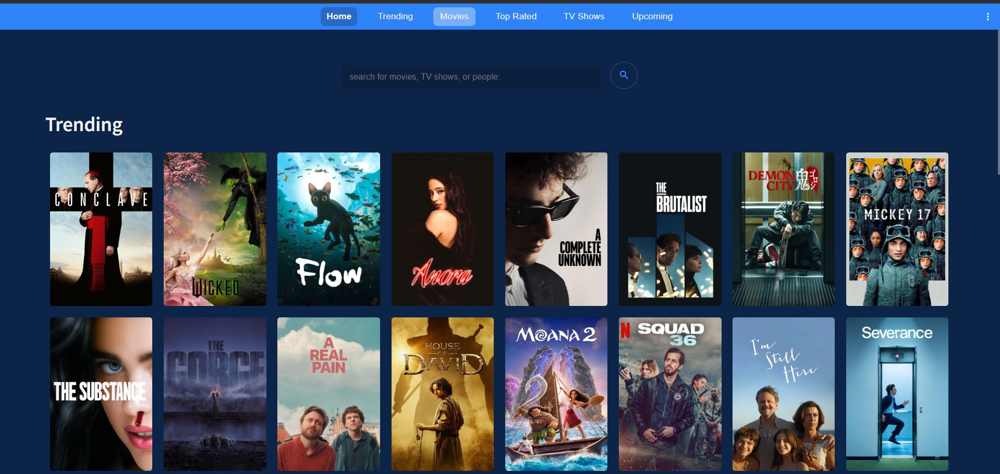
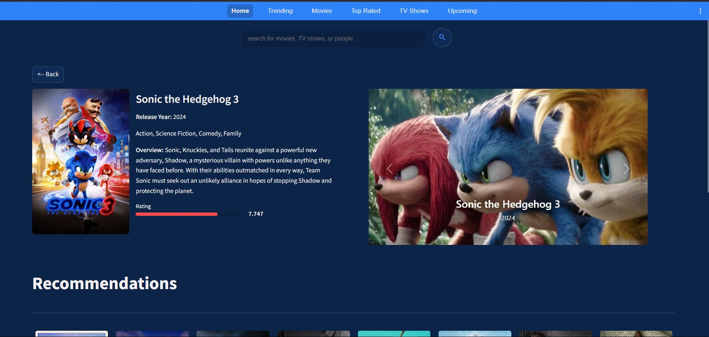
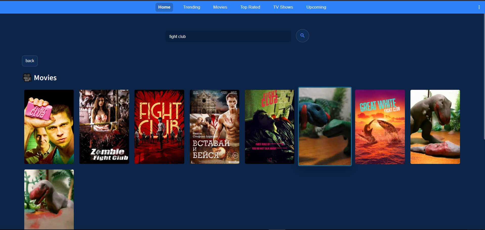

# Streamlit Movie & TV App

## 📌 Overview
This is a **Streamlit-powered Movie & TV App** that utilizes the **TMDB API** to display trending movies, discover new content, and search for specific movies or TV shows. Users can navigate between sections such as:
- **Trending**
- **Discover Movies**
- **Discover TV Shows**
- **Search for Movies & TV Shows**
- **Get detailed information on a specific item**

## 🚀 Features
- 🔍 **Search Bar** – Find movies and TV shows easily.
- 📌 **Navigation Bar** – Switch between Trending, Movies, and TV Shows.
- 🗂 **Category Browsing** – Explore trending content, discover new movies & TV series.
- 📄 **Detailed Info Pages** – View details of a specific movie or TV show.
- 🎨 **Modern UI** – Simple and elegant Streamlit-based user interface.

## 📷 Screenshots
Here are some previews of the application:

### 🔻 Trending Movies


### 🔻 Movie Details


### 🔻 Search Results


## 🛠 Installation & Setup
### 1️⃣ Clone the Repository
```sh
git clone https://github.com/ayoubmori/Movies-App.git
cd Movies-App
```

### 2️⃣ Install Dependencies
Ensure you have Python installed, then run:
```sh
pip install -r requirements.txt
```

### 3️⃣ Set Up TMDB API Key
1. Get an API key from [TMDB](https://www.themoviedb.org/).
2. Create a `.env` file in the project root and add:
   ```env
   TMDB_API_KEY=your_api_key_here
   ```

### 4️⃣ Run the App
Run the **batch file** provided for easy execution:
```sh
start run_app.bat
```
OR manually run:
```sh
python -m streamlit run app/main.py
```

## 📜 How to Use
1. **Run the app** using the above command.
2. Use the **navigation bar** to switch between pages.
3. Enter a **search query** in the search bar to find movies or TV shows.
4. Click on an item to view **detailed information**.

## 📌 Tech Stack
- **Frontend & Backend**: Streamlit
- **API**: TMDB API
- **Language**: Python
- **Dependency Management**: `pip`

## 🤝 Contributing
Feel free to submit issues or feature requests. Pull requests are welcome!

---
Made with ❤️ by Ayoub Taouabi

